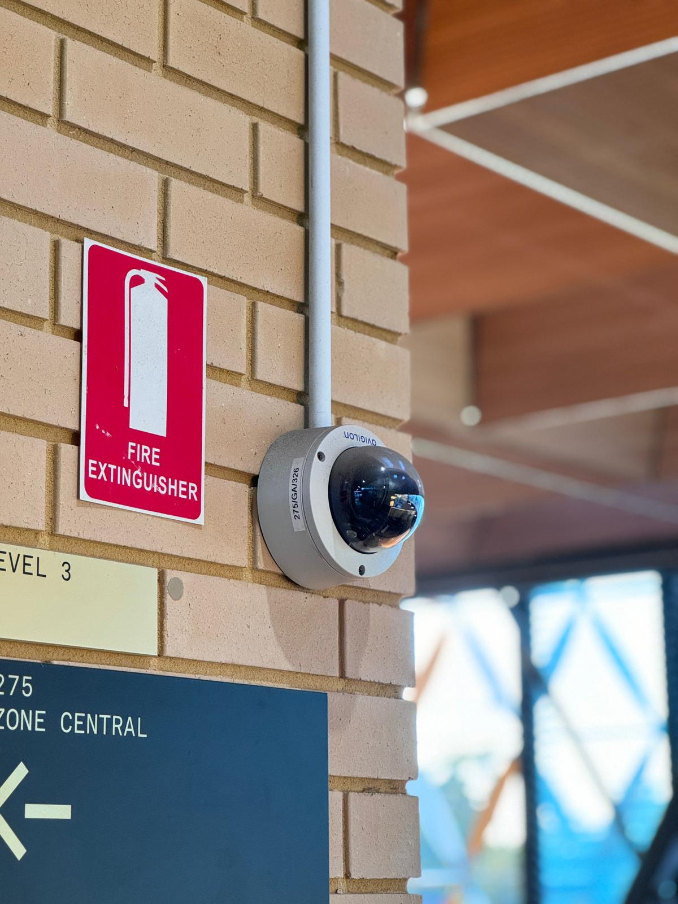
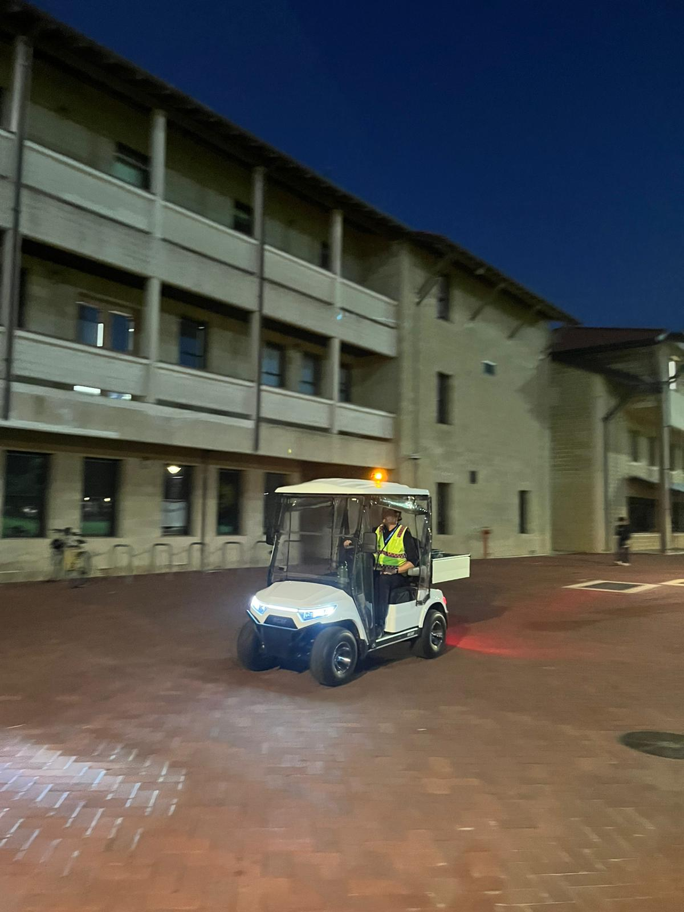
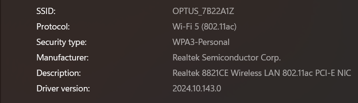

# A1: Discover Security Concepts Used on Campus

## Overview
This activity explores different security concepts implemented on my university campus. These systems help protect people, assets, and information.

## Security Concepts Identified

### 1. CCTV Surveillance Cameras
- **Location:** Building entrances, hallways, and common areas
- **Purpose:** Monitor activity and record incidents
- **Security Concept:** Deterrence + Monitoring

### 2. Security Guards
- **Location:** Main entrances and patrol areas
- **Purpose:** Respond to incidents and enforce rules
- **Security Concept:** Physical Security + Incident Response

### 3. Secure Wi-Fi (WPA2/WPA3 Enterprise)
- **Location:** Campus-wide network
- **Purpose:** Protect network access using login credentials
- **Security Concept:** Network Security + Encryption

## Reflection
The campus uses a combination of physical and digital security mechanisms. These systems work together to ensure safety, prevent unauthorized access and respond to incidents effectively. This demonstrates the importance of layered security (defense in depth).

## Conclusion
Security on campus is implemented through multiple technologies and practices, including surveillance, authentication systems and network protection. These measures help maintain a safe learning environment.
