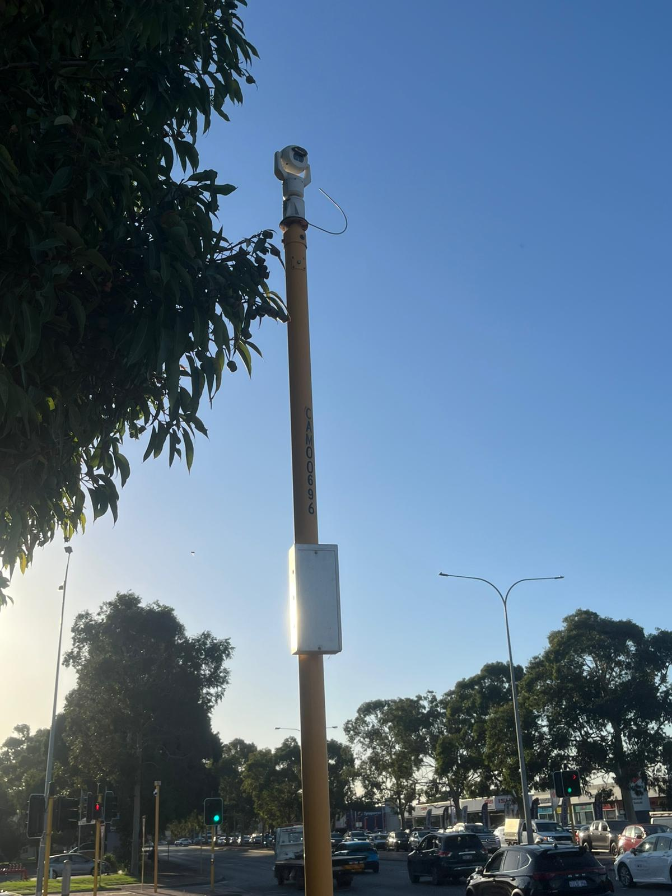
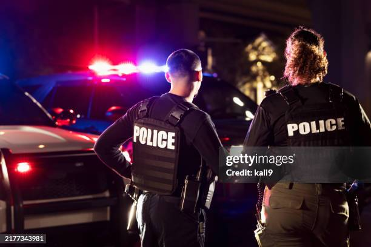

# A2: Discover Security Concepts Used in Public Space

## Overview
This activity explores security mechanisms used in public spaces such as shopping centers, streets and transport areas.

## Security Concepts Identified

### 1. Traffic Cameras / Speed Cameras
- **Location:** Roads and intersections
- **Purpose:** Enforce traffic laws and detect violations
- **Security Concept:** Monitoring + Law Enforcement

### 2. Police Patrols
- **Location:** Public areas, events
- **Purpose:** Maintain law and order and respond to incidents
- **Security Concept:** Physical Security + Incident Response

### 3. Public Wi-Fi Login Portals
- **Location:** Cafes, malls, airports
- **Purpose:** Require users to accept terms or log in before accessing internet
- **Security Concept:** Access Control + User Tracking

### 4. Anti-theft Tags (Retail Stores)
- **Location:** Clothing stores, supermarkets
- **Purpose:** Prevent shoplifting by triggering alarms at exits
- **Security Concept:** Asset Protection + Detection

## Reflection
Public spaces rely heavily on visible security measures to deter crime and ensure safety. These systems focus on monitoring, enforcement and rapid response. Many security mechanisms are intentionally placed in visible locations to make individuals aware that they are being monitored which reduces the likelihood of theft or malicious behaviour.

## Conclusion
Security in public spaces combines monitoring law enforcement and preventive technologies to protect people and property.
