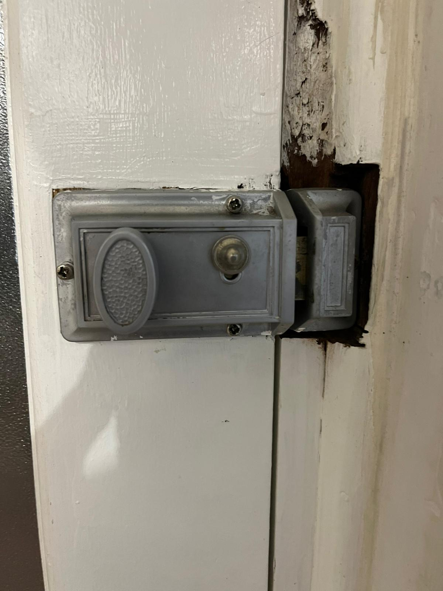
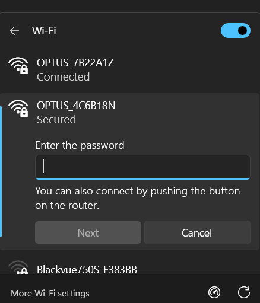
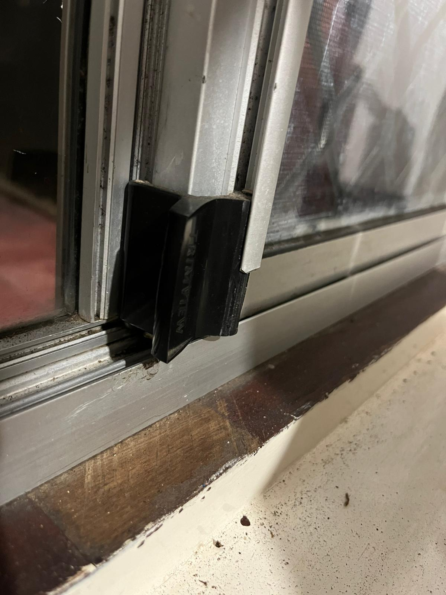
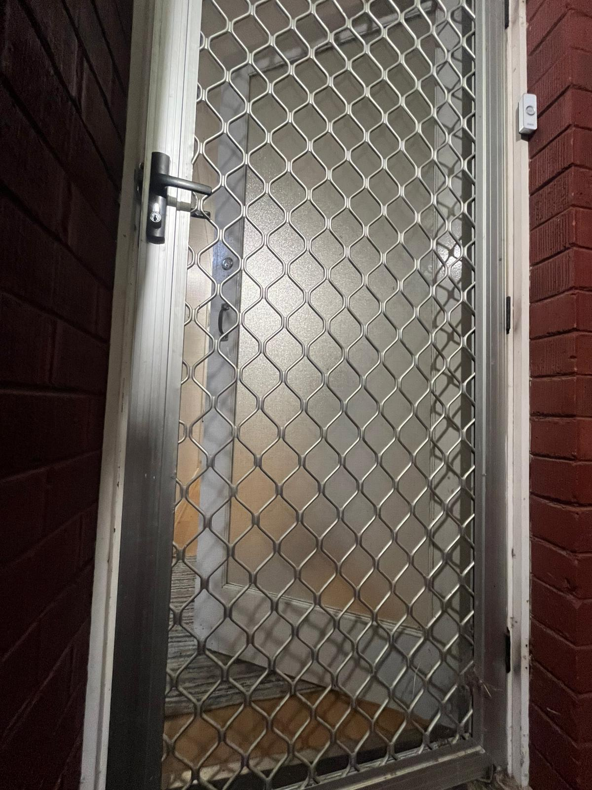

# A3: Discover Security Concepts Used in Your House

## Overview
This activity examines the security measures implemented in my home environment.

## Security Concepts Identified

### 1. Door Locks
- **Type:** Deadbolt lock
- **Purpose:** Prevent unauthorized entry
- **Security Concept:** Physical Access Control

### 2. Wi-Fi Password Protection
- **Type:** WPA3 password
- **Purpose:** Prevent unauthorized network access
- **Security Concept:** Authentication + Encryption

### 3. Window Locks
- **Location:** Windows throughout house
- **Purpose:** Prevent forced entry
- **Security Concept:** Physical Security

### 4. Device Authentication (Phone/Laptop)
- **Type:** Password / fingerprint / Face ID
- **Purpose:** Protect personal data
- **Security Concept:** Authentication

### 5. Double Door System (Mesh Door + Glass Door)
- **Description:** My house has two doors: an outer mesh/security door and an inner glass door.
- **Purpose:** Adds an extra layer of protection before entering the house
- **Security Concept:** Defense in Depth + Physical Access Control

## Reflection
My home uses multiple layers of security, including physical barriers such as a double door system and detection systems like fire alarms. The use of two doors demonstrates the concept of defense in depth where multiple layers of protection reduce the likelihood of unauthorized access.
Additionally, safety mechanisms like faceID highlight that security is not only about preventing attacks, but also about preventing unknown access from environmental threats.

## Conclusion
A layered approach to home security helps protect against both physical and cyber threats.
