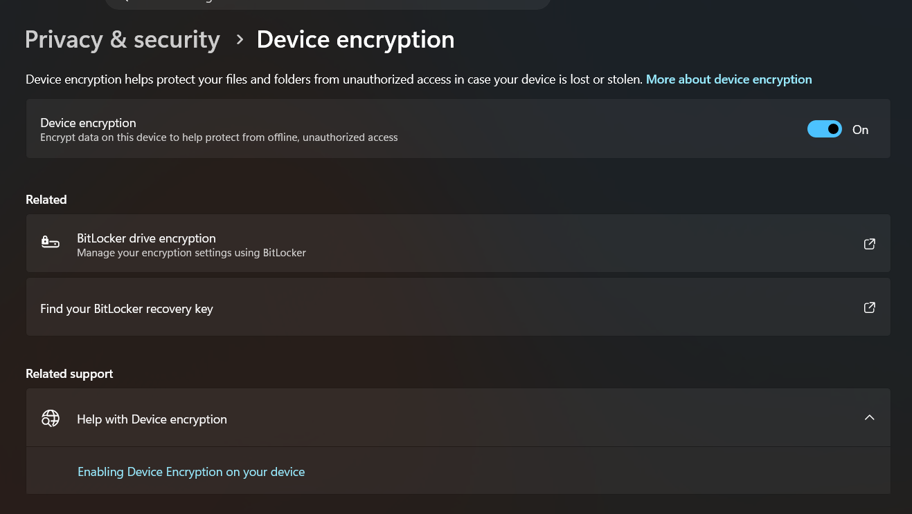
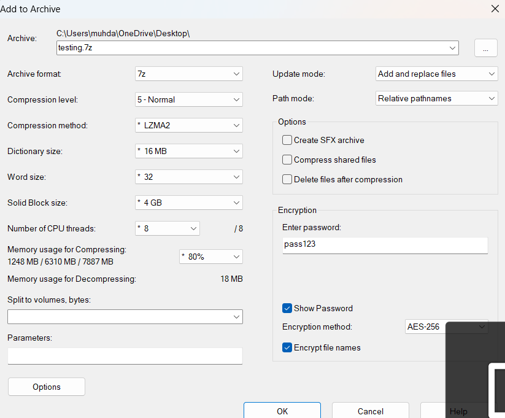
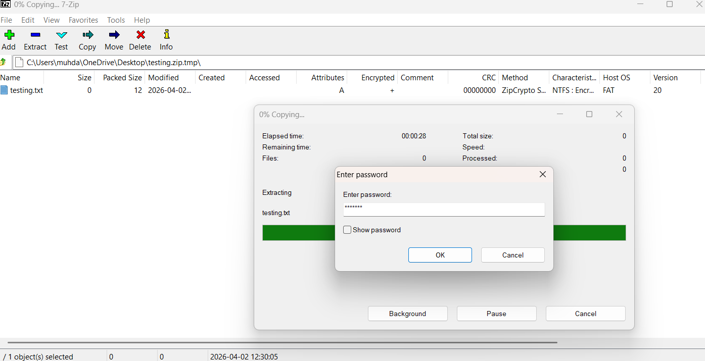

# A6: Discover Cryptographic Implementation Used Offline

## Overview
This activity explores how cryptography is used in offline environments to protect data and ensure confidentiality without using internet.

## Cryptographic Implementations

### 1. BitLocker Drive Encryption
- Used to encrypt entire hard drives on Windows systems
- Protects data even if the device is lost or stolen
- Uses strong encryption algorithms such as AES
- Security Concept: Data Encryption and Confidentiality

Evidence:

### 2. File Encryption (Password Protected ZIP File)
- Files can be encrypted using password protection with tools such as 7-Zip
- Prevents unauthorized users from accessing file contents
- Uses encryption methods such as AES-256
- Security Concept: Encryption and Access Control

Evidence:

## Reflection
Cryptography plays an important role in offline environments by protecting stored data from unauthorized access. Even without internet connectivity encryption ensures that sensitive information remains secure.

## Conclusion
Offline cryptographic implementations such as full disk encryption and file level encryption are essential for maintaining data confidentiality and protecting devices against physical threats such as theft or loss.
