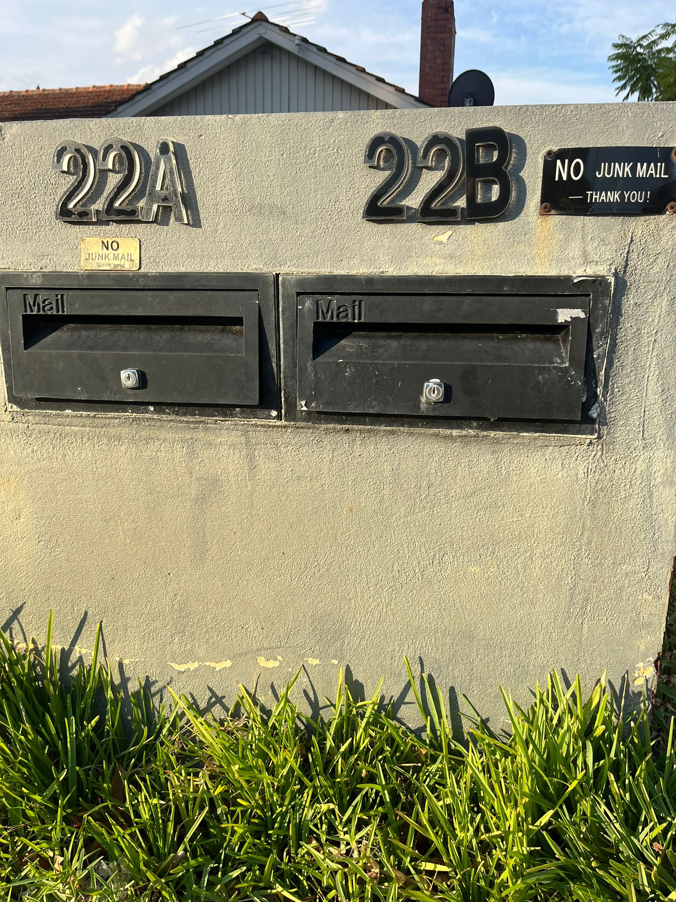
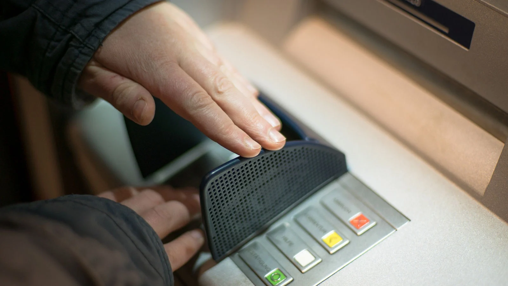

# A10: Discover Privacy Techniques Used Offline

## Overview
This activity explores privacy protection techniques used in offline (non-digital) environments. These techniques help protect personal and sensitive information from unauthorized physical access and observation.

## Privacy Techniques Identified

### 1. Locked Mailbox
- **Description:** Mail is delivered into a locked mailbox that can only be accessed with a key
- **Purpose:** Prevent unauthorized individuals from accessing personal letters, bills, or confidential documents
- **Privacy Concept:** Data Protection + Confidentiality

### 2. Shredding Documents
- **Description:** Sensitive documents such as bank statements or personal records are shredded before disposal
- **Purpose:** Prevent identity theft and ensure that confidential information cannot be reconstructed or misused
- **Privacy Concept:** Data Disposal + Confidentiality

### 3. Private Conversations in Secured Areas
- **Description:** Sensitive discussions are conducted in private rooms or closed environments
- **Purpose:** Prevent others from overhearing confidential information such as personal or financial details
- **Privacy Concept:** Information Confidentiality

### 4. Covering Personal Information
- **Description:** Individuals hide their PIN or sensitive data when entering it on devices such as ATMs or payment terminals
- **Purpose:** Prevent shoulder surfing and unauthorized observation of confidential information
- **Privacy Concept:** Privacy Protection + Human Awareness

## Reflection
Offline privacy techniques play a critical role in protecting sensitive information from physical access and observation. Simple practices such as shredding documents, securing mail, and protecting personal inputs demonstrate how everyday actions contribute to maintaining privacy.

## Conclusion
Privacy is not limited to digital systems. Offline techniques are essential in preventing information leakage and protecting personal data in everyday environments.
