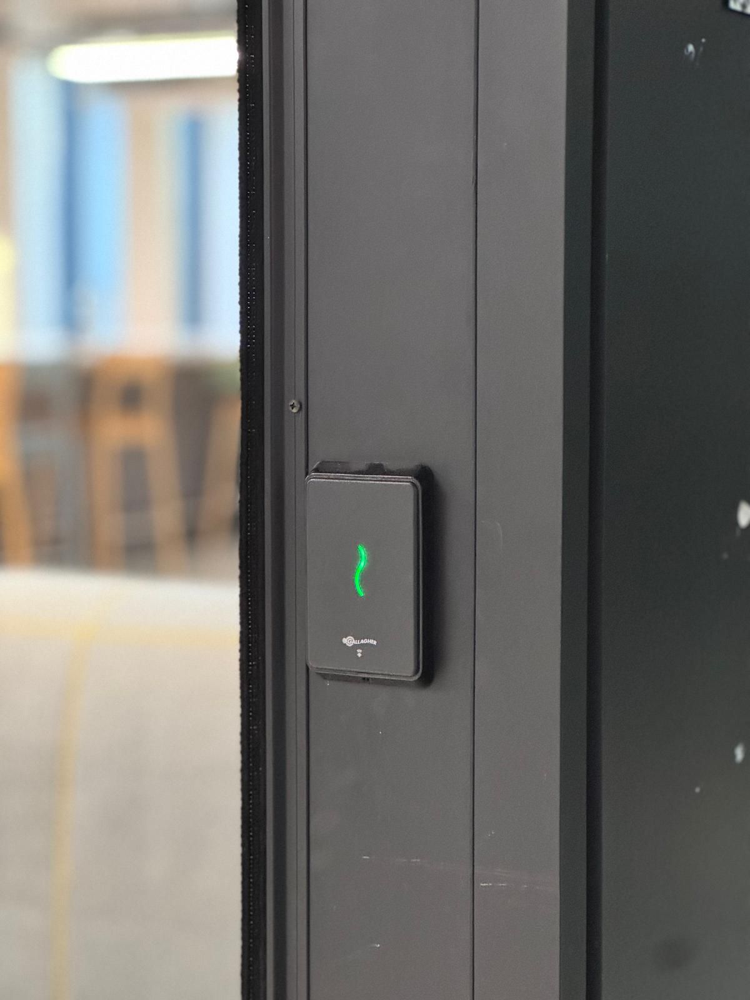
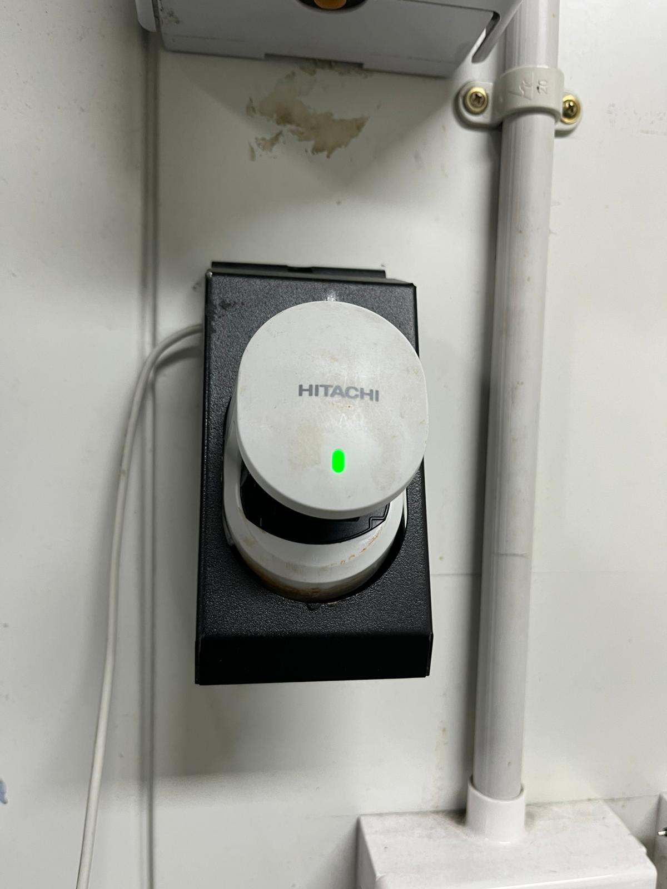
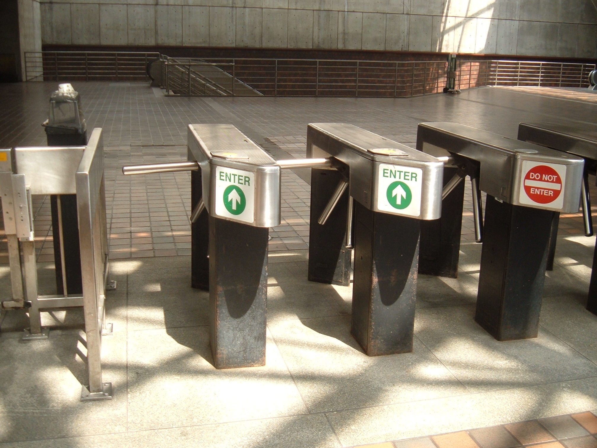
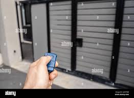

# A11: Discover 5 Unique Access Control Devices

## Overview
This activity explores different access control devices used to restrict and manage entry to systems or physical spaces.

## Access Control Devices

### 1. RFID Card Reader
- **Location:** University labs, offices
- **Function:** Requires a card to unlock doors
- **Security Concept:** Authentication + Access Control

### 2. Biometric Scanner (Fingerprint / Face ID)
- **Location:** Smartphones, secure facilities
- **Function:** Uses unique biological traits for access
- **Security Concept:** Strong Authentication

### 3. Turnstile Gate
- **Location:** Train stations, stadiums, metro stations
- **Function:** Allows entry only after valid ticket or card scan
- **Security Concept:** Access Control + Authentication

### 4. Password-Protected Login System
- **Location:** Computers, websites
- **Function:** Requires username + password
- **Security Concept:** Authentication

### 5. Garage Remote Control Gate
- **Location:** Residential homes, parking areas
- **Function:** Allows access only when a remote control signal is used
- **Security Concept:** Access Control + Authentication

## Reflection
Access control devices are essential for restricting unauthorized access. Different methods such as biometrics, passwords and physical tokens provide varying levels of security.

## Conclusion
Combining multiple access control methods improves security and reduces the risk of unauthorized access.
