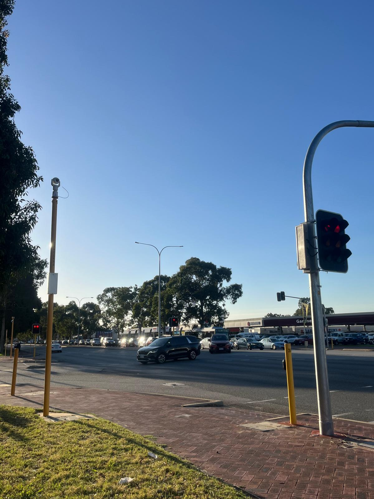
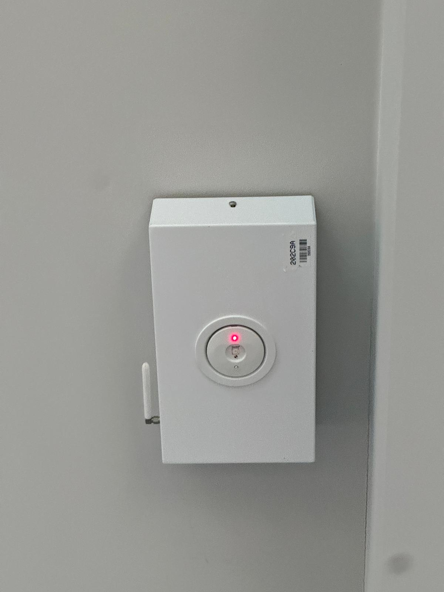
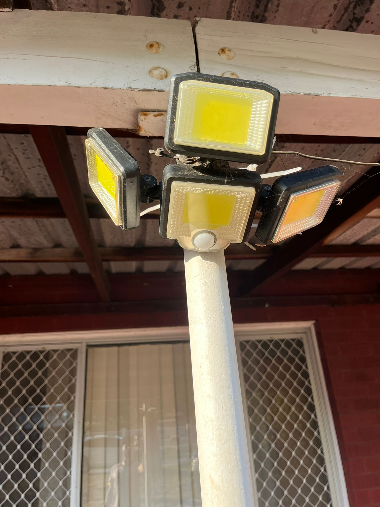
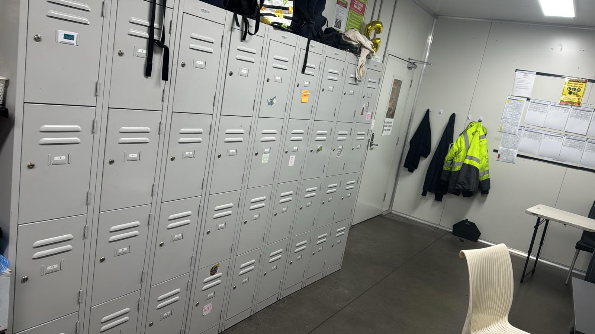
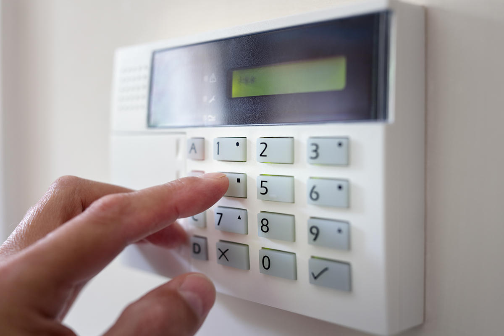

# A12: Discover 5 Unique Offline Security Tools

## Overview
This activity explores security tools that are used offline to protect people, property and information without relying on internet connectivity.

## Offline Security Tools

### 1. Traffic Signal Lights
- **Description:** Lights used at intersections to control vehicle and pedestrian movement
- **Purpose:** Prevent accidents and maintain order on roads
- **Security Concept:** Safety Control + Risk Prevention

### 2. Fire Alarm System
- Detects smoke or fire inside a building
- Alerts occupants to evacuate immediately
- Security Concept: Incident Detection and Safety

### 3. Motion Sensor Lights
- Automatically turn on when movement is detected
- Helps deter intruders at night
- Security Concept: Detection and Deterrence

### 4. Safe or Locker
- Used to store valuable items securely
- Requires a key or code to access
- Security Concept: Asset Protection and Access Control

### 5. Security Alarm System
- Triggers a loud alarm when unauthorized entry is detected
- Common in houses and businesses
- Security Concept: Intrusion Detection and Response

## Reflection
Offline security tools play an important role in protecting physical environments. Tools such as alarms and motion sensors help detect and respond to threats quickly while visible systems like cameras act as deterrents.

## Conclusion
Offline security tools provide essential protection even without internet connectivity. They help prevent unauthorized access, detect incidents, and improve overall safety.
