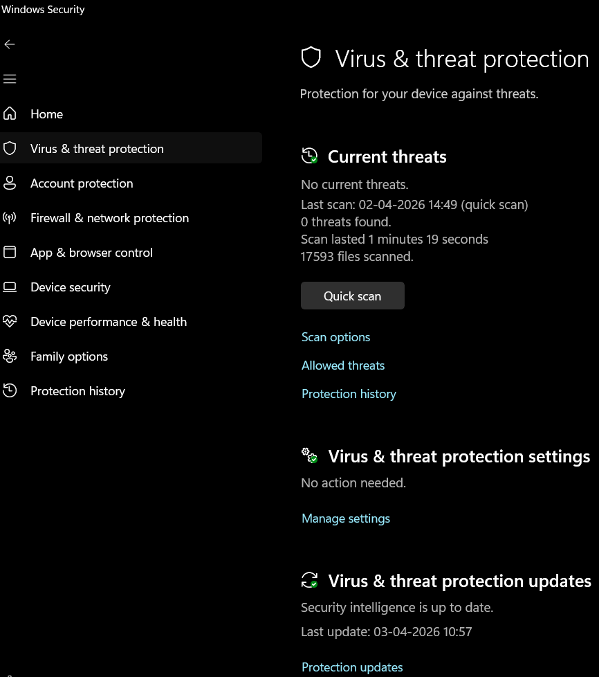
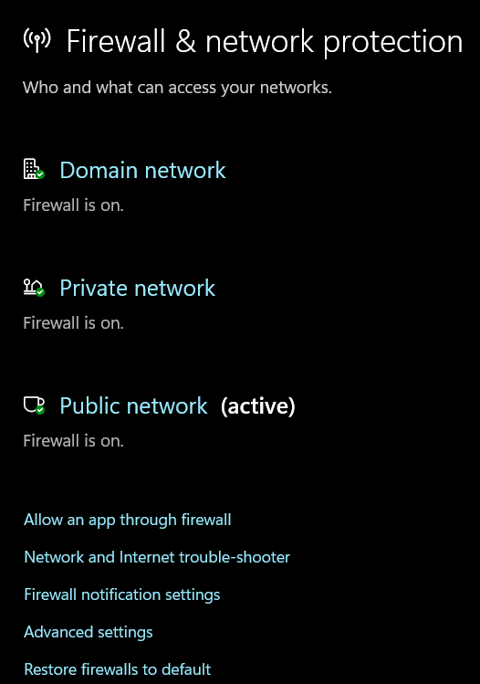
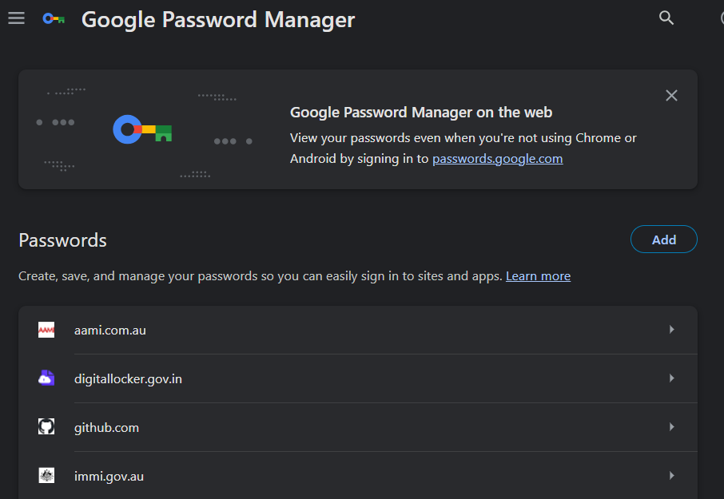
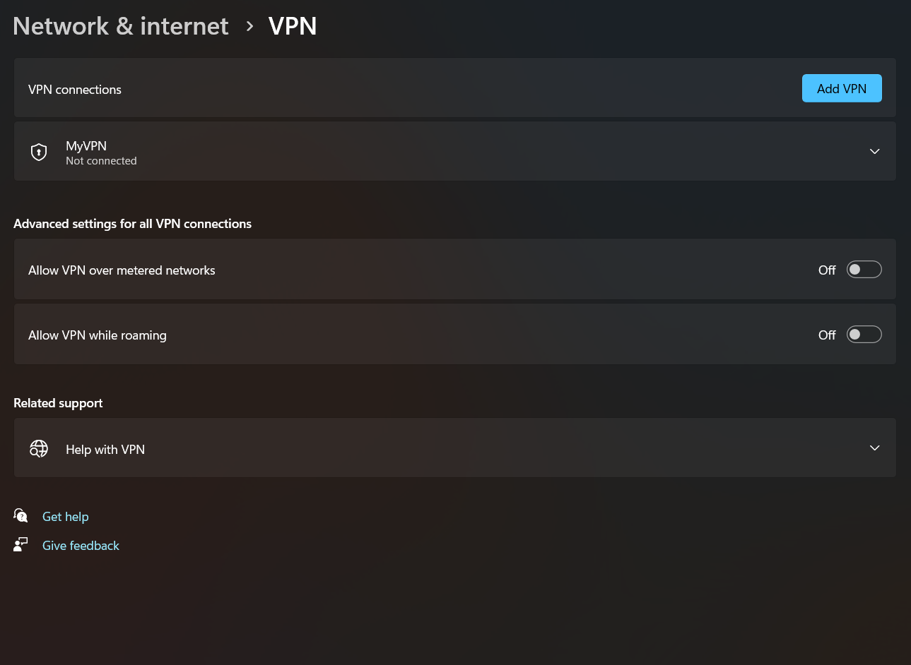
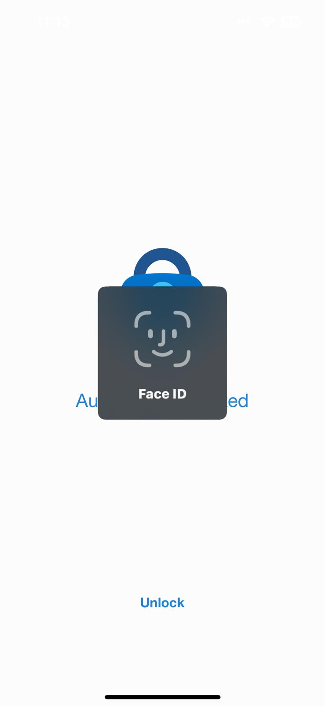

# A13: Discover 5 Unique Online Security Tools

## Overview
This activity explores security tools that are used online to protect systems data and users from cyber threats.

## Online Security Tools

### 1. Antivirus Software
- Protects devices from malware and viruses
- Scans files and removes threats
- Security Concept: Threat Detection and Prevention

### 2. Firewall
- Monitors incoming and outgoing network traffic
- Blocks unauthorized access
- Security Concept: Network Security and Access Control

### 3. Password Manager
- Stores and generates strong passwords
- Helps users avoid weak or repeated passwords
- Security Concept: Authentication and Credential Management

### 4. Virtual Private Network (VPN)
- Encrypts internet traffic and hides user IP address
- Protects user privacy especially on public networks
- Prevents tracking and data interception
- Security Concept: Encryption and Privacy Protection

### 5. Multi Factor Authentication (MFA)
- Requires more than one form of verification
- Adds an extra layer of security beyond passwords
- Security Concept: Strong Authentication

## Reflection
Online security tools are essential for protecting users and systems from cyber threats. These tools help detect prevent and respond to attacks while also improving privacy and data protection.

## Conclusion
Using multiple online security tools together provides stronger protection and reduces the risk of cyber attacks.
