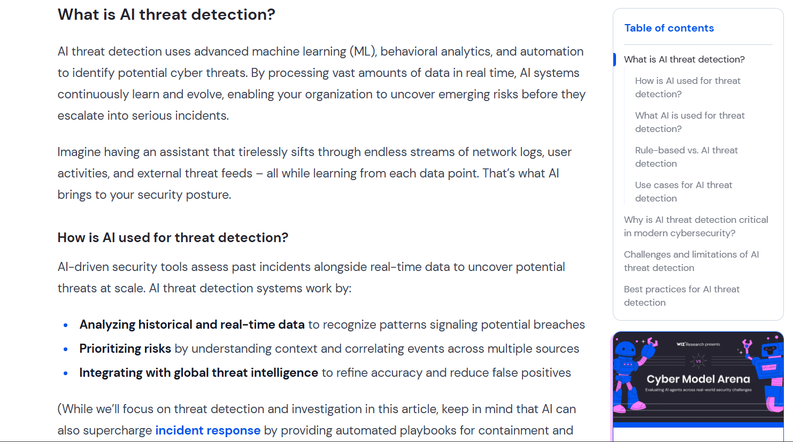
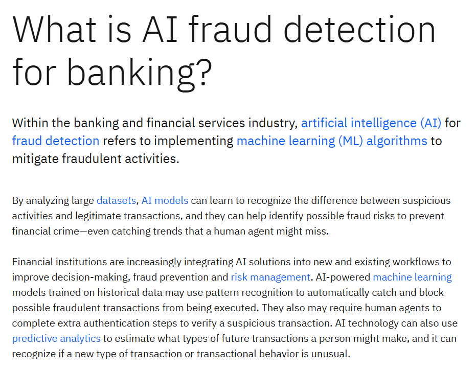
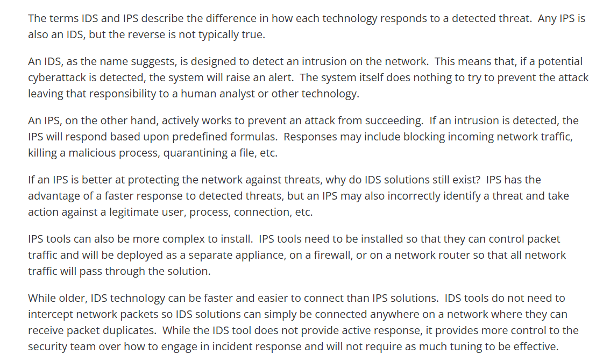
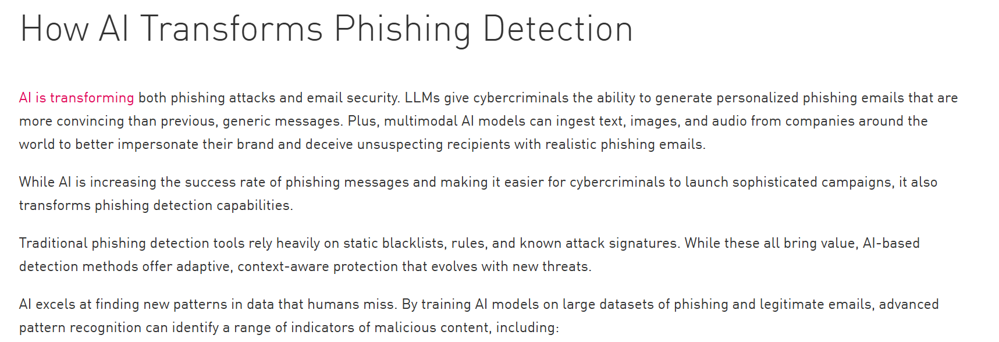

# A14: Discover 5 AI-Enabled Security Solutions

## Overview
This activity explores how artificial intelligence is used in cybersecurity to detect prevent and respond to threats. AI enables faster and more accurate identification of security risks by analysing patterns and behaviours in real time.

## AI-Enabled Security Solutions

### 1. AI Based Threat Detection Systems
- Uses machine learning to detect unusual patterns in network traffic
- Identifies potential cyber attacks in real time
- Helps security teams respond quickly to threats
- Security Concept: Threat Detection and Anomaly Detection

Source:
Snegha Ramnarayanan, Bedi, B., Mast, G., & Nati Beeri. (2026, March 23). Introducing Wiz Agents & Workflows: Security at the Speed of AI. Wiz.io. https://www.wiz.io/blog/introducing-wiz-agents

### 2. AI Powered Antivirus Software
- Uses AI to detect new and unknown malware
- Analyses behaviour instead of relying only on known signatures
- Improves detection accuracy and response time
- Security Concept: Malware Detection and Prevention

### 3. Fraud Detection Systems
- Used in banking and online transactions to detect suspicious activity
- AI identifies unusual spending patterns and flags potential fraud
- Helps prevent financial loss and identity theft
- Security Concept: Fraud Detection and Risk Analysis

### 4. AI Driven Intrusion Detection Systems (IDS)
- Monitors network traffic for suspicious activity
- Uses AI to reduce false positives and improve detection accuracy
- Detects potential intrusions in real time
- Security Concept: Network Security and Intrusion Detection

### 5. AI Based Phishing Detection
- Detects phishing emails using artificial intelligence and pattern recognition
- Identifies suspicious links and fake messages
- Helps protect users from social engineering attacks
- Security Concept: Email Security and Threat Prevention

.png)

## Reflection
AI has significantly improved cybersecurity by enabling faster and more accurate detection of threats. It reduces human error and helps organisations respond to attacks more efficiently.

## Conclusion
AI-enabled security solutions play a critical role in modern cybersecurity by enhancing detection prevention and response capabilities. These technologies are essential for protecting systems and data from evolving cyber threats.
