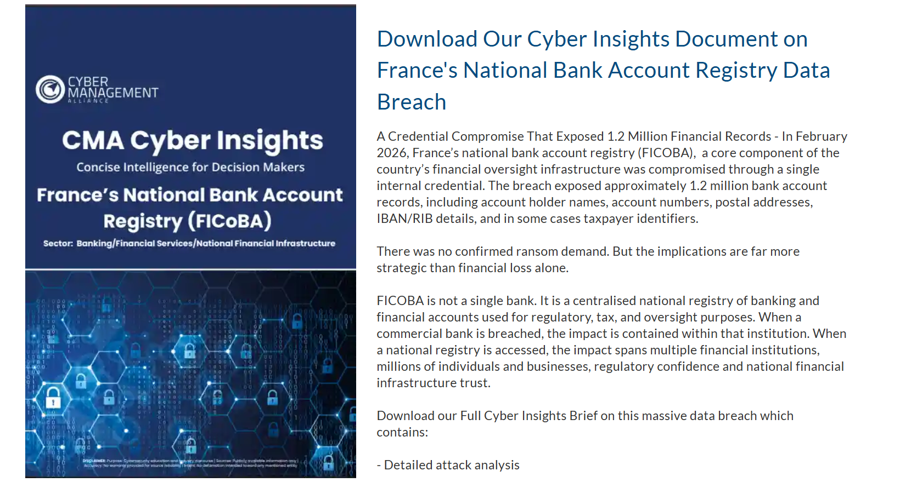
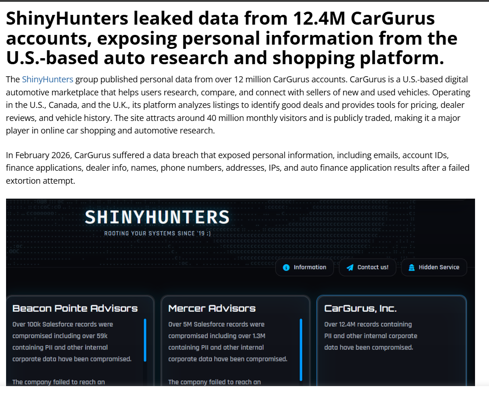
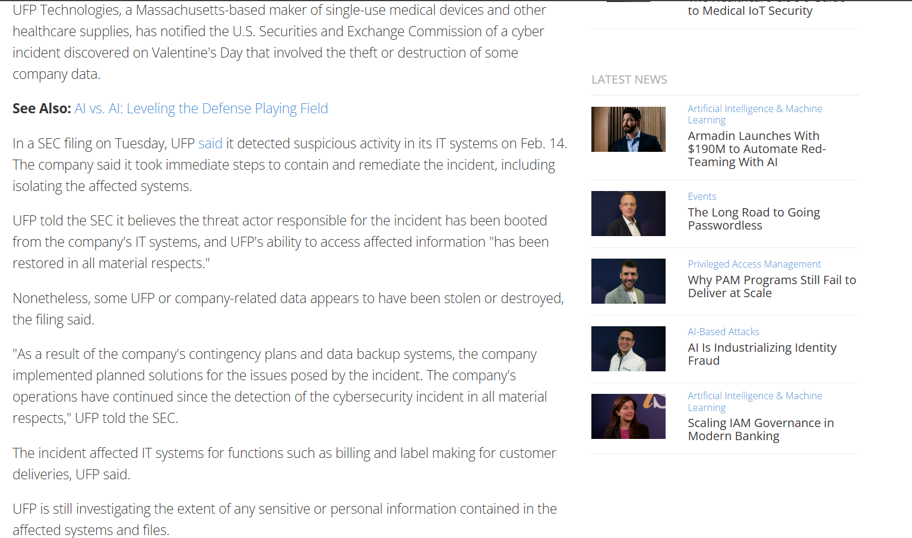
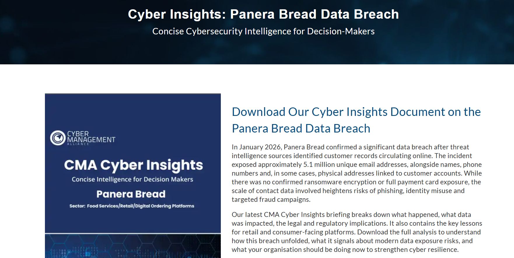
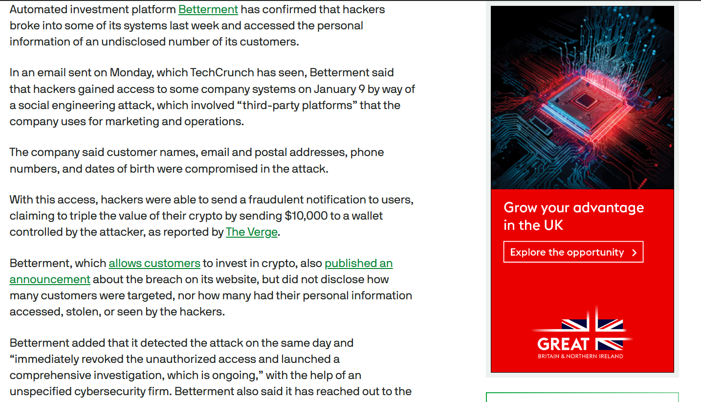

# A15 – Discover 5 Recent Security Incidents

This activity identifies five recent cybersecurity incidents and explains what happened, what information was affected, and the main cause of each breach.

## Incident 1 – France National Bank Registry Breach (2026)

In February 2026, France’s national bank account registry (FICOBA) experienced a cybersecurity breach that exposed approximately 1.2 million financial records including account holder names, account numbers, and banking details.

**Cause of the breach:**  
The breach occurred due to a compromised internal credential, which allowed attackers to gain unauthorized access to the national financial registry.

**Impact:**  
Sensitive financial data was exposed, increasing risks of financial fraud and identity theft.

## Incident 2 – CarGurus Data Breach (2026)

In February 2026, the ShinyHunters hacking group leaked personal data from more than 12 million CarGurus user accounts. The breach exposed names, email addresses, phone numbers, and IP addresses.

**Cause of the breach:**  
Attackers reportedly gained access through stolen credentials and social engineering techniques targeting company systems.

**Impact:**  
Millions of users had their personal information exposed online.

## Incident 3 – UFP Technologies Cyber Incident (2026)

UFP Technologies detected suspicious activity in its IT systems in February 2026 and reported the incident to the U.S. Securities and Exchange Commission.

**Cause of the breach:**  
Unauthorized access to internal IT systems by a threat actor.

**Impact:**  
Some company data may have been stolen or destroyed and several internal operations such as billing and delivery processes were disrupted.

## Incident 4 – Panera Bread Data Breach (2026)

In January 2026, Panera Bread confirmed that customer records had been circulating online, exposing around 5.1 million email addresses along with names, phone numbers, and physical addresses.

**Cause of the breach:**  
The breach was likely caused by a vulnerability or misconfigured database that allowed attackers to access customer data.

**Impact:**  
Although payment information was not exposed, the leaked data increased the risk of phishing attacks and identity misuse.

## Incident 5 – Betterment Data Breach (2026)

In January 2026, the investment platform Betterment confirmed that hackers accessed company systems through a social engineering attack.

**Cause of the breach:**  
Attackers used social engineering and exploited third-party platforms used for marketing and operations to gain access to internal systems.

**Impact:**  
Customer information including names, email addresses, phone numbers, postal addresses, and dates of birth were exposed.

## Reflection

Researching these incidents helped me understand that cybersecurity breaches can occur in many industries including banking, healthcare, retail, and financial services. Also these are just some incidents happened a month ago. This clearly shows the importance of cybersecurity in the modern world.
Many attacks are caused by compromised credentials, social engineering, or system vulnerabilities.
This highlights the importance of strong authentication, monitoring systems, and cybersecurity awareness.
