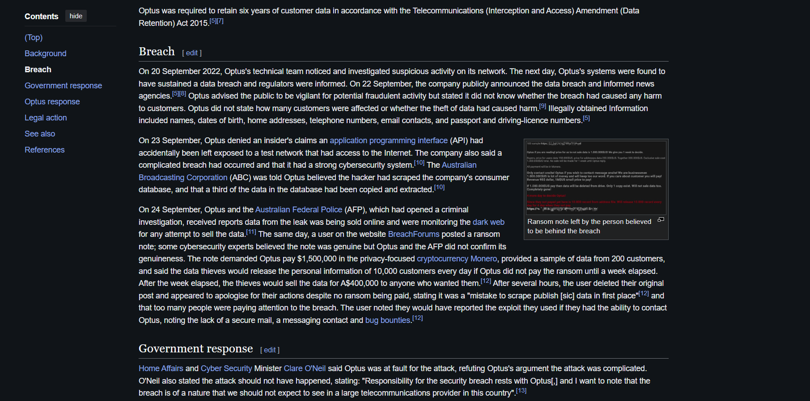
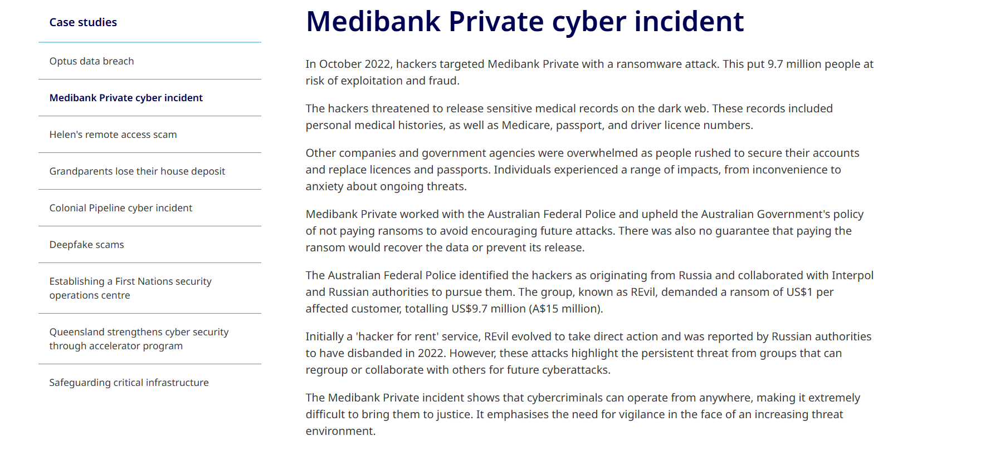
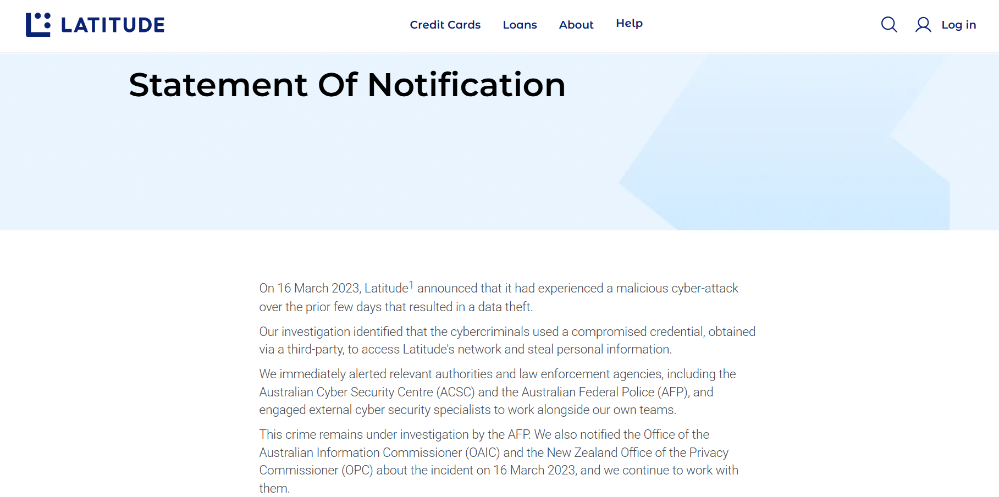
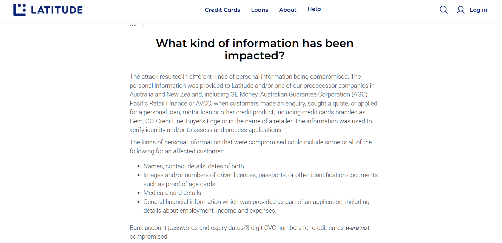

# A16: Discover 3 Local Security Incidents

## Overview
This activity explores recent security incidents that have occurred locally. These incidents highlight real-world cybersecurity threats and their impact.

## Local Security Incidents

### 1. Optus Data Breach (Australia)
- Personal data of millions of customers was exposed
- Information included names addresses and identification details
- Impact: Risk of identity theft and fraud
- Security Concept: Data Breach and Information Security Failure

Evidence:

Source:
https://en.wikipedia.org/wiki/2022_Optus_data_breach

### 2. Medibank Cyber Attack (Australia)
- Hackers accessed sensitive health data of customers
- Data was leaked online after ransom was not paid
- Impact: Privacy violation and reputational damage
- Security Concept: Ransomware and Data Exposure

Evidence:

Source:
https://www.qld.gov.au/community/your-home-community/cyber-security/cyber-security-for-queenslanders/case-studies/medibank-private-cyber-incident

### 3. Latitude Financial Data Breach (Australia)
- Personal information such as driver licence numbers was stolen
- Affected millions of customers
- Impact: Identity theft risk and financial fraud
- Security Concept: Data Breach and Access Control Failure

Evidence:

Source:
https://www.latitudefinancial.com.au/cyber-statement-of-notification/
## Reflection
These incidents show that even large organizations can suffer from cybersecurity failures. Poor security practices and weak protection mechanisms can lead to serious consequences for users.

## Conclusion
Local security incidents highlight the importance of strong cybersecurity measures including data protection access control and incident response.
