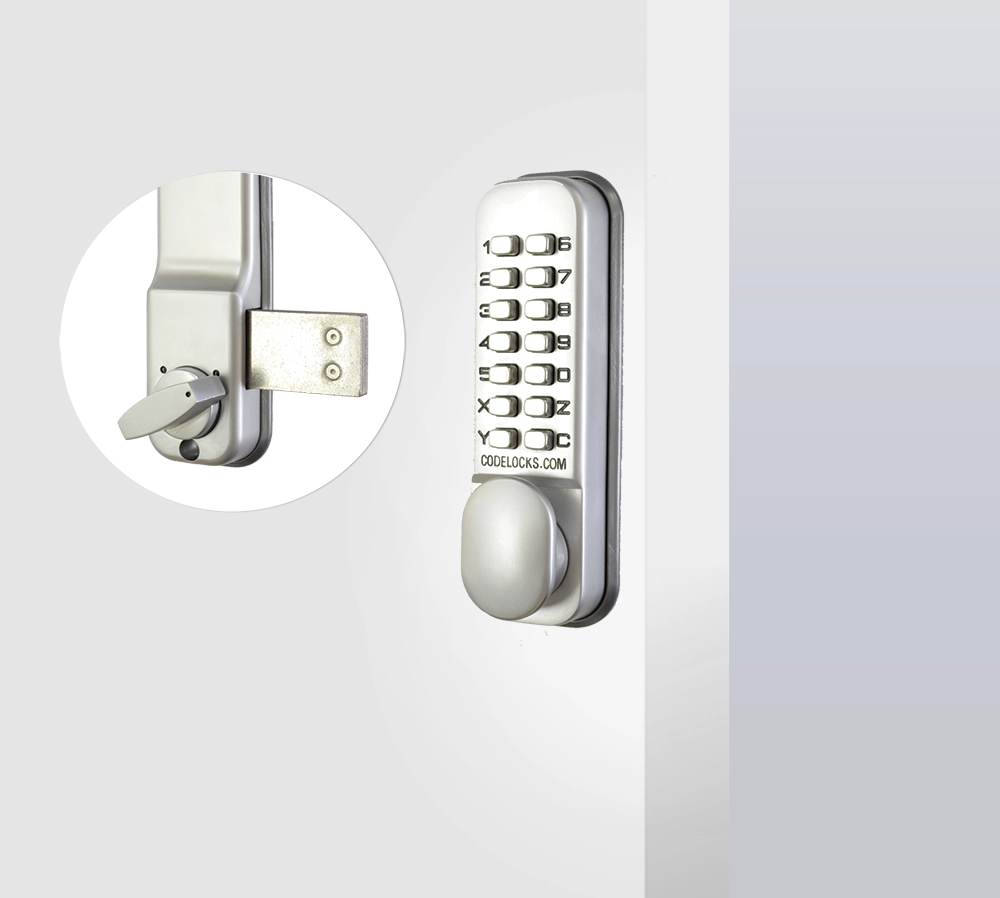
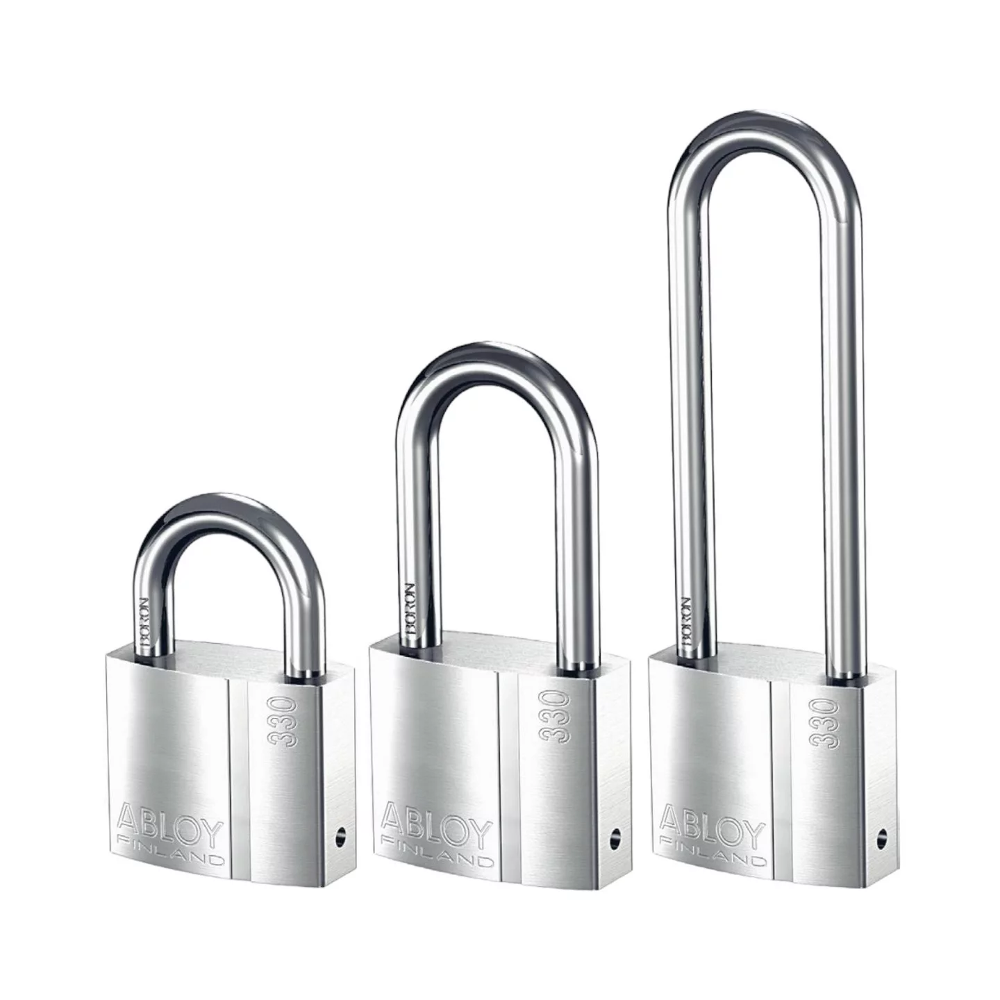
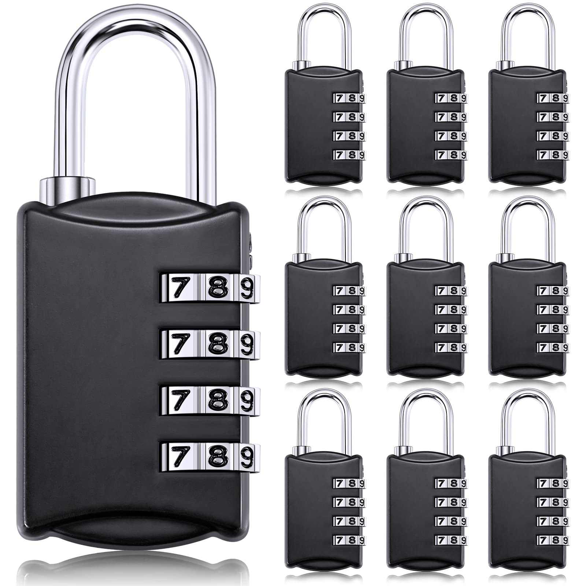
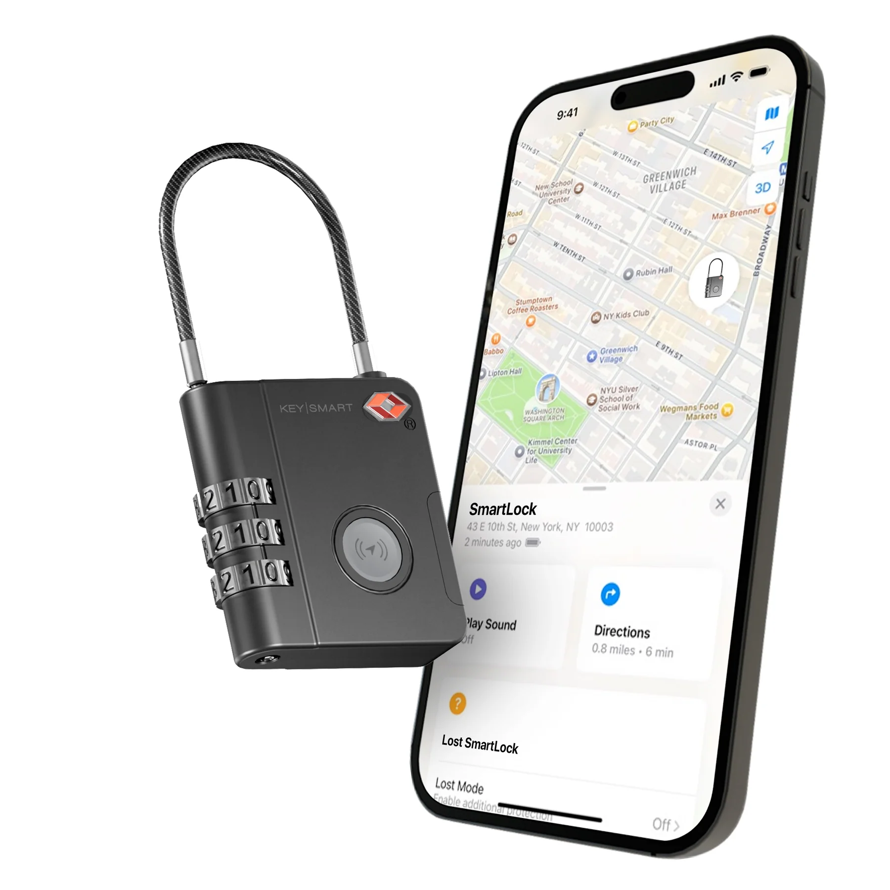
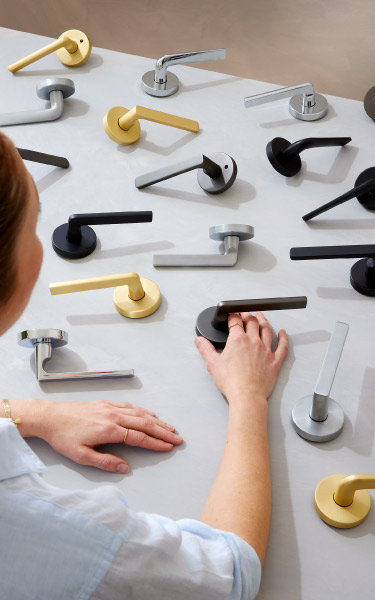
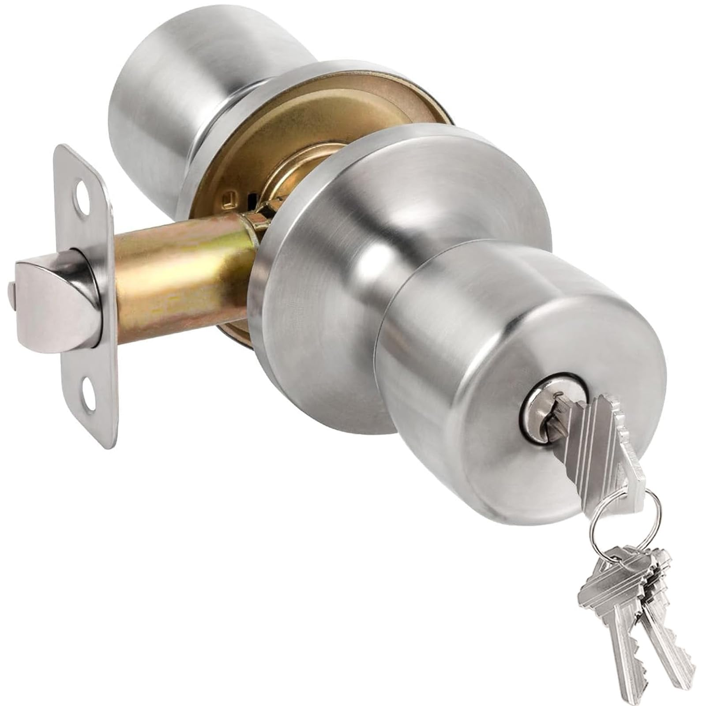
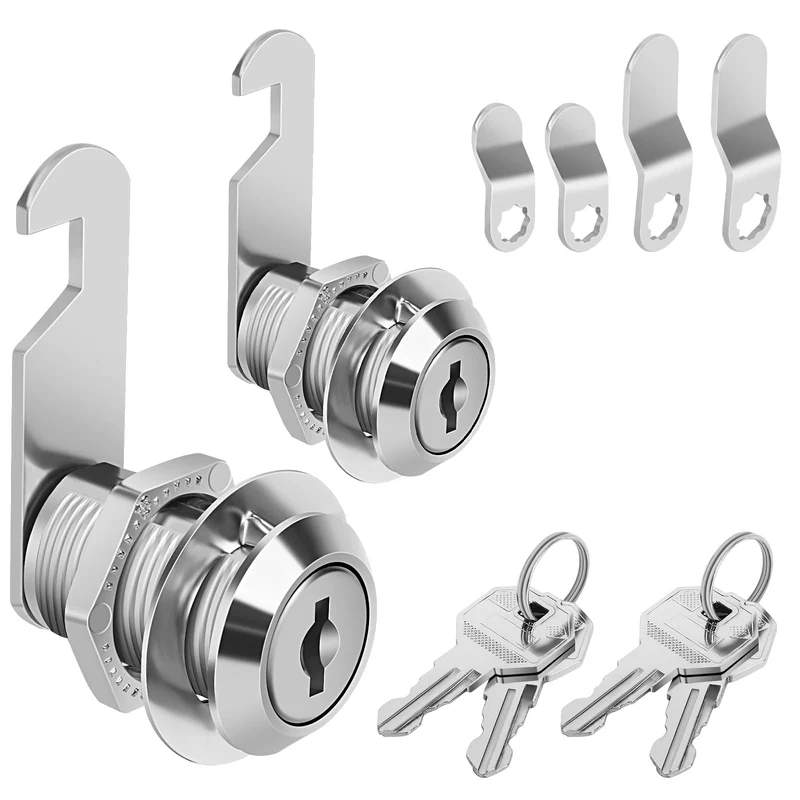
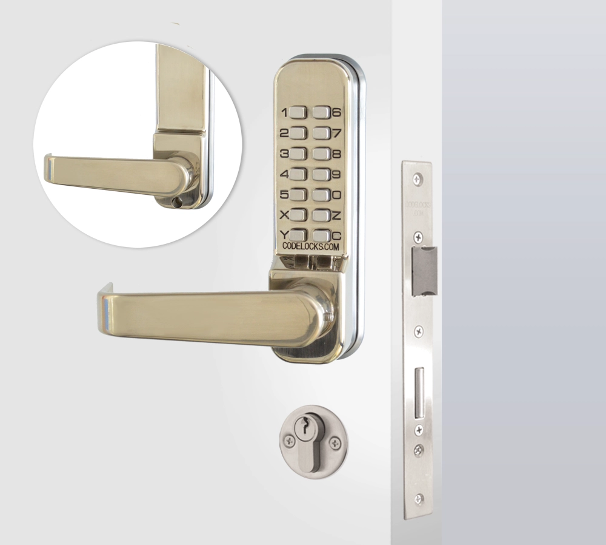
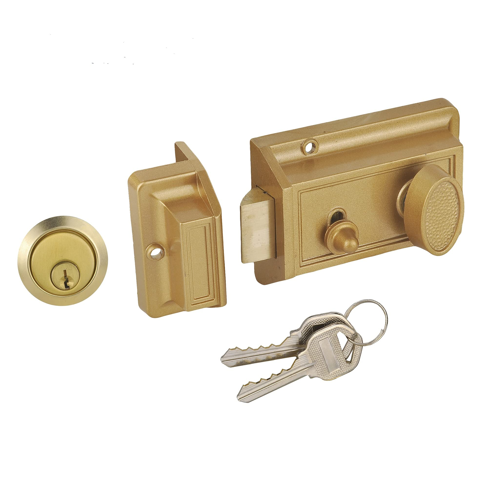
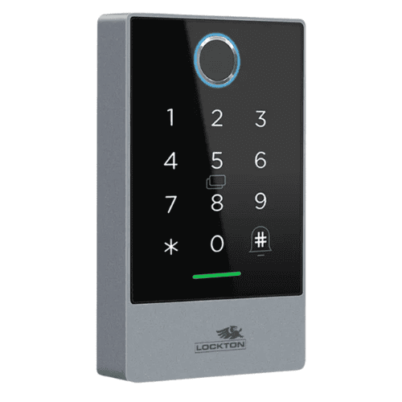

# A17: Discover 10 Different Types of Locks

## Overview
This activity explores different types of locks used in everyday life to secure physical assets and property.

## Types of Locks

### 1. Deadbolt Lock
- Commonly used on house doors
- Provides strong resistance against forced entry
- Security Concept: Physical Security and Access Control

### 2. Padlock
- Portable lock used for gates and lockers
- Can be key-based or combination-based
- Security Concept: Asset Protection

### 3. Combination Lock
- Uses a numeric code instead of a key
- Commonly used in school or gym lockers
- Security Concept: Authentication

### 4. Smart Lock
- Controlled using a smartphone or app
- Allows remote locking and unlocking
- Security Concept: Digital Access Control and Authentication

### 5. Lever Handle Lock
- Found on interior doors
- Easier to operate but provides lower security
- Security Concept: Basic Access Control

### 6. Knob Lock
- Built into door knobs
- Common in residential settings but not very secure on its own
- Security Concept: Basic Physical Security

### 7. Cam Lock
- Used in cabinets and drawers
- Simple mechanism for securing small storage spaces
- Security Concept: Data and Asset Protection

### 8. Mortise Lock
- Installed inside the door structure
- Strong and durable locking system
- Security Concept: High-Level Physical Security

### 9. Rim Lock
- Mounted on the surface of a door
- Often found in older buildings
- Security Concept: Surface-Level Access Control

### 10. Electronic Keypad Lock
- Requires a PIN code for access
- Common in offices and rental properties
- Security Concept: Authentication and Access Control

## Reflection
Different types of locks provide different levels of protection depending on their design and usage. Stronger locks such as deadbolts and mortise locks offer better resistance to forced entry while simpler locks are used for convenience and basic security.

## Conclusion
Choosing the right type of lock is important for protecting property and reducing the risk of unauthorized access.
