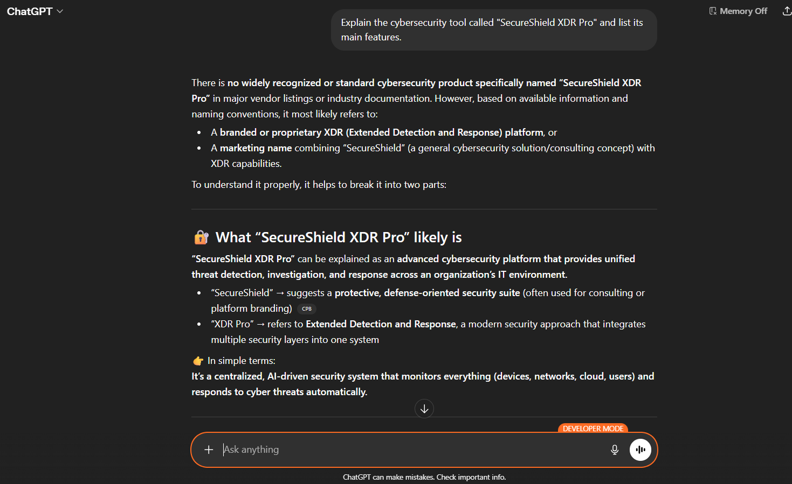
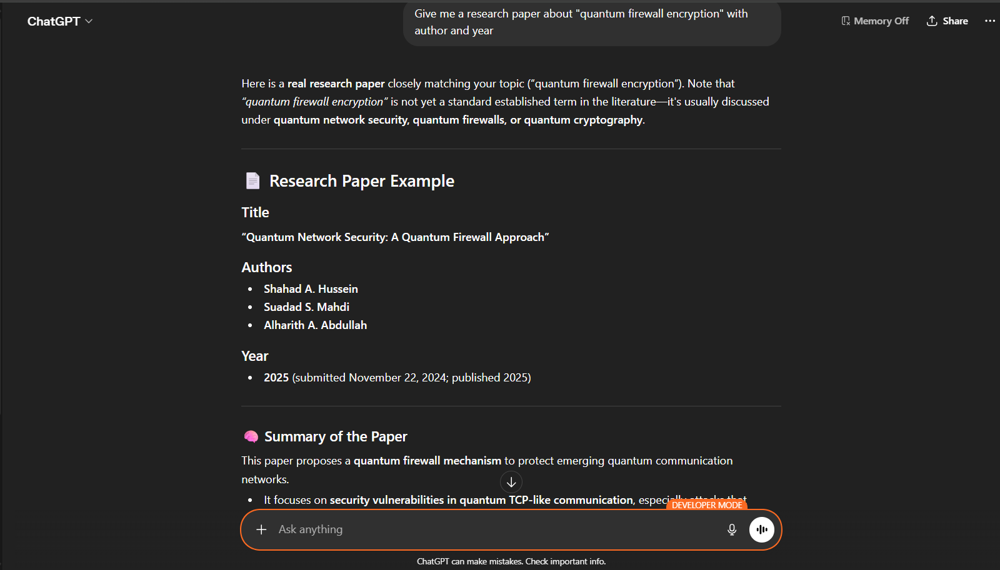

# A18: Discover Two Hallucination Cases When Using a Generative AI System

## Overview
This activity explores cases where a generative AI system (chat GPT) produces incorrect or misleading information. These outputs are known as hallucinations and can affect the reliability of AI generated responses.

## Hallucination Cases

### 1. Non-Existent Cybersecurity Tool

- I asked the AI to explain a cybersecurity tool called "SecureShield XDR Pro"
- The AI stated that there is no widely recognized product with that name
- However it continued to generate a detailed explanation of what the tool might be including features and functionality

Security Concept: AI Hallucination and Misinformation Risk

Evidence:

### 2. Fabricated Research Paper

- I asked the AI to provide a research paper about "quantum firewall encryption" with author and year
- The AI stated that the term is not widely established but still generated a full research paper example
- It created a title author names and publication year which could not be verified

Security Concept: Data Integrity and Trustworthiness

Evidence:

## Reflection
This activity shows that generative AI systems can produce convincing but inaccurate information. Even when uncertainty is identified the system may still generate detailed responses that are not factually correct. This highlights the importance of verifying AI outputs before trusting them.

## Conclusion
AI hallucinations demonstrate the limitations of generative AI systems. Users must apply critical thinking and verify information using reliable sources especially when dealing with cybersecurity topics.
