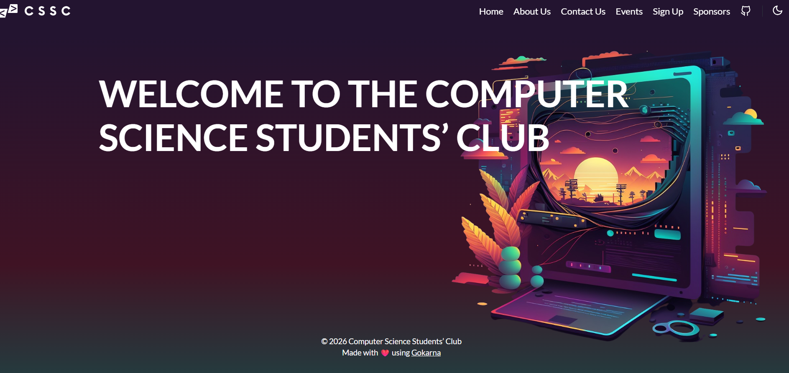

# A19: Join a CS/DS/Cybersecurity Club

## Overview
This activity involves joining a cybersecurity related community to engage with others and learn more about current trends and discussions in the field.

## Club Joined

- I joined the Computer Science Students Club (CSSC) at the University of Western Australia
- CSSC is a student organisation that runs social educational and professional events for computer science students
- The club provides opportunities to interact with other students who share similar interests in technology and cybersecurity
- It also offers a space for students to collaborate learn and participate in various activities

Evidence:

## About the Club

- CSSC organises events such as games nights quiz nights and technical meetups
- It provides a clubroom for students to study collaborate and relax
- The club encourages engagement among students in the field of computer science and software engineering
- It helps build a strong community of learners and future professionals

## Activities and Participation

## 1. Engaging with Students
- Interacted with other students who are interested in cybersecurity and related fields
- Shared ideas and discussed different topics in computing
- Security Concept: Community Learning

## 2. Exposure to Events and Discussions
- Observed club activities and events that promote learning and collaboration
- Gained awareness of different areas in cybersecurity and technology
- Security Concept: Knowledge Sharing

## 3. Learning Environment
- Being part of the club provides opportunities to learn from peers and seniors
- Helps in understanding real world applications and career pathways in cybersecurity
- Security Concept: Professional Development and Awareness

## Reflection
Joining the CSSC helped me connect with other students and become part of a learning community. It improved my awareness of cybersecurity topics and provided opportunities to engage in discussions and activities related to the field.

## Conclusion
Participating in a university club such as CSSC is an effective way to learn collaborate and stay updated with developments in cybersecurity and technology.
