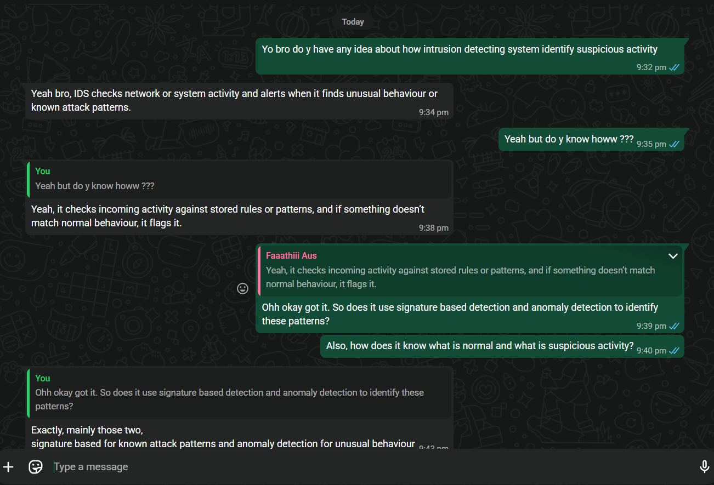

# A21: Participate in an Online Cybersecurity Discussion

## Overview
This activity involves participating in an online discussion related to cybersecurity to learn from others and share ideas about security topics.

## Platform Used

- I participated in an online cybersecurity discussion with a friend through WhatsApp
- The platform allowed us to communicate and exchange ideas in real time
- The discussion focused on understanding how cybersecurity systems detect threats

Evidence:

## Discussion Topic

- The discussion focused on how intrusion detection systems (IDS) identify suspicious activity in a network
- We explored how these systems monitor traffic and detect potential threats

## Key Points from Discussion

### 1. How Intrusion Detection Systems Work
- We discussed that IDS monitors network traffic continuously
- It analyses data packets to identify unusual or suspicious patterns
- Security Concept: Network Monitoring and Threat Detection

### 2. Signature-Based Detection
- IDS compares network activity with known attack patterns (signatures)
- Helps detect previously identified threats quickly
- Security Concept: Signature-Based Detection

### 3. Anomaly-Based Detection
- IDS identifies unusual behaviour that deviates from normal activity
- Can detect new or unknown attacks
- Security Concept: Anomaly Detection

### 4. Importance of IDS in Cybersecurity
- Helps detect attacks early before they cause damage
- Provides alerts to system administrators
- Security Concept: Intrusion Detection and Response

## Reflection
Discussing intrusion detection systems with a friend helped me better understand how cybersecurity tools identify threats in real time. It improved my knowledge of how networks are monitored and protected.

## Conclusion
Online discussions are an effective way to learn cybersecurity concepts. Understanding how intrusion detection systems work is important for identifying and preventing cyber attacks.
