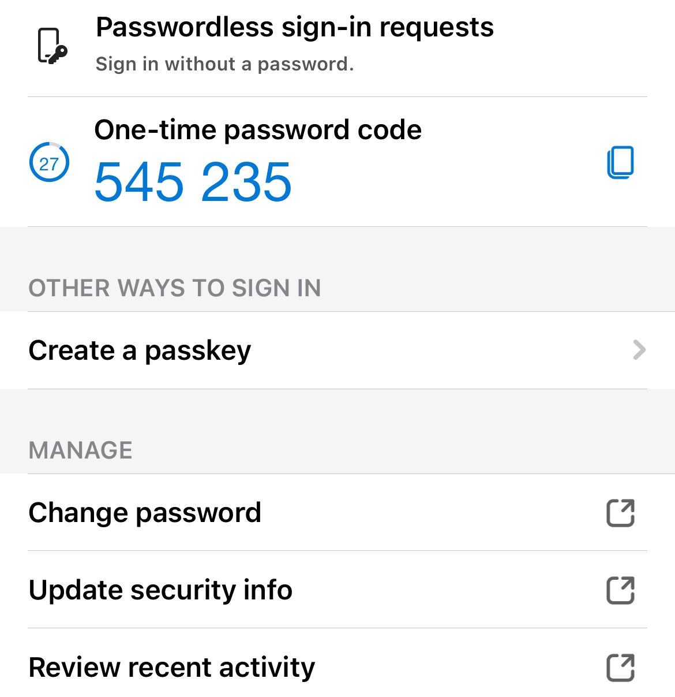

# A23: Enhance the Cybersecurity at Your Home

## Overview
This activity involves improving the security of personal online accounts by implementing stronger authentication methods to protect against unauthorized access and cyber threats.

## Improvement Made

### Enabled Multi Factor Authentication (MFA)
- I enabled multi factor authentication on my personal account and housemates account to enhance account security
- MFA requires an additional verification step such as a one time code generated by an authenticator app or sent to a trusted device
- This ensures that even if a password is compromised an attacker cannot gain access without the second authentication factor
- The authentication process uses time based one time passwords (TOTP) which are securely generated and expire after a short duration
- This significantly reduces the risk of account takeover phishing attacks and credential theft
- Security Concept: Strong Authentication, Access Control and Defense in Depth

Evidence:

## Impact of the Improvement
- Increased account security by adding an extra verification layer
- Reduced vulnerability to password based attacks
- Improved overall protection of personal data and online identity

## Reflection
Enabling multi factor authentication demonstrated how a simple security improvement can provide strong protection against modern cyber threats. It highlighted the importance of using layered security instead of relying only on passwords.

## Conclusion
Implementing MFA is an effective and practical way to improve home cybersecurity. It strengthens account protection by combining multiple authentication factors and reduces the risk of unauthorized access.
