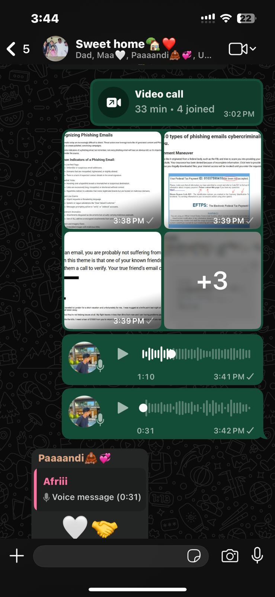

# A24: Conduct a Cybersecurity Awareness Activity

## Overview
This activity involves raising awareness about cybersecurity risks and safe online practices by educating others.

## Activity Conducted

- As an international student I organised an online awareness session with my family members
- I arranged a 30-minute meeting with my father mother and two sisters
- The session was conducted through an online video call platform
- The purpose of the session was to educate them about phishing attacks and how to stay safe online

Evidence:

## Topics Covered

### 1. What is Phishing
- Explained phishing as a cyber attack where attackers trick users into revealing sensitive information
- Showed examples of fake emails and messages
- Security Concept: Social Engineering

### 2. Types of Phishing Attacks
- Email phishing
- SMS phishing (smishing)
- Fake websites
- Security Concept: Threat Awareness

### 3. How to Identify Phishing
- Check sender email address carefully
- Avoid clicking suspicious links
- Look for spelling mistakes and unusual messages
- Security Concept: Risk Identification

### 4. Prevention Techniques
- Do not share passwords or personal information
- Enable multi factor authentication
- Verify links before clicking
- Security Concept: User Awareness and Protection

## Reflection
Conducting this awareness session helped me understand the importance of educating others about cybersecurity risks. Even basic knowledge about phishing can significantly reduce the chances of becoming a victim. It also showed how awareness plays a key role in strengthening overall security.

## Conclusion
Cybersecurity awareness is essential in preventing attacks such as phishing. Educating family members and others helps create a safer digital environment and reduces the risk of cyber threats.
