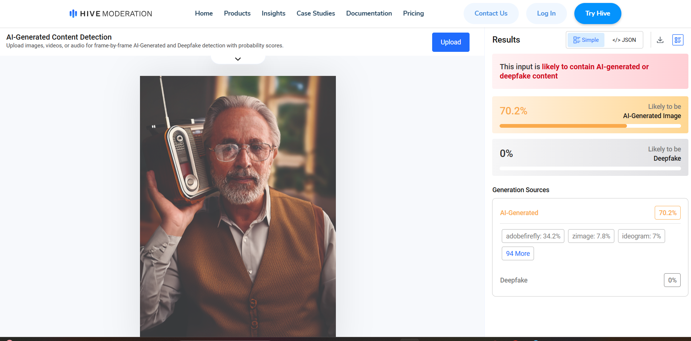

# A29: Find a publicly available AI-generated image, video, or audio clip, use at least one detection or verification tool to analyse it.

## Overview
This activity involves using an AI detection tool to analyse whether an image was generated by artificial intelligence. This helps in identifying synthetic media and understanding how AI-generated content can be verified.

## Activity Performed

### AI Image Detection
- I found an image which shows a realistic portrait of an elderly man holding a radio
- I uploaded this image to an AI detection platform (Hive Moderation)
- The tool analysed the image based on patterns, textures and visual inconsistencies commonly found in AI-generated images
- The result indicated that the image is **likely to contain AI-generated content**

- The detection score showed:
  - **70.2% probability of being AI-generated**
  - **0% probability of being a deepfake**

- The tool also provided generation source indicators such as:
  - Adobe Firefly (34.2%)
  - Zimage (7.8%)
  - Ideogram (7%)

- This demonstrates how detection systems analyse multiple signals to classify whether content is synthetic

- Security Concept: AI Detection, Digital Content Verification, and Misinformation Prevention

Evidence:

## Analysis of Result
- The detection tool identified that the image has a high likelihood of being AI-generated (70.2%)
- It did not classify the image as a deepfake, meaning the image is synthetic but not manipulated from a real person
- The system analysed features such as:
  - Consistent lighting and texture patterns
  - Slight artificial smoothness in facial details
  - Background blur and composition typical of AI-generated images

- The breakdown of possible generation sources shows how AI detectors compare the image against known AI models

## Reflection
This activity demonstrated that AI-generated images can be detected using specialised tools, even when they appear highly realistic. It highlights the importance of verifying digital media, especially with the increasing use of AI-generated content in everyday applications.

## Conclusion
AI image detection tools play a critical role in maintaining trust in digital content. They help identify synthetic images and reduce the risk of misinformation. As AI technology continues to evolve, such tools become essential for cybersecurity, digital forensics, and content verification.
